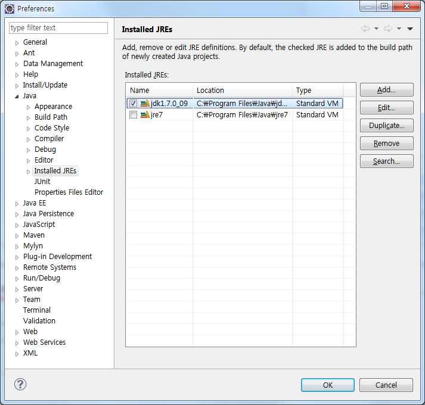
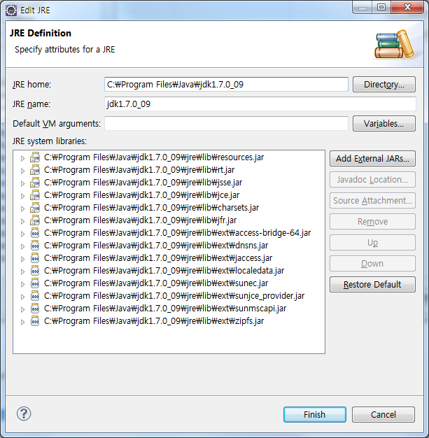

# 메이븐 컴파일 오류 : Installed_JREs 수정하기

        [ERROR] Failed to execute goal org.apache.maven.plugins:maven-compiler-plugin:3.0:compile (default-compile) on project Millky2: Compilation failure

        [ERROR] No compiler is provided in this environment. Perhaps you are running on a JRE rather than a JDK?

        [ERROR] -> [Help 1]

        [ERROR] 

        [ERROR] To see the full stack trace of the errors, re-run Maven with the -e switch.

        [ERROR] Re-run Maven using the -X switch to enable full debug logging.

        [ERROR] 

        [ERROR] For more information about the errors and possible solutions, please read the following articles:

        [ERROR] [Help 1] http://cwiki.apache.org/confluence/display/MAVEN/MojoFailureException
        

# Ex =============================================================================================================================================================================
        
        

        
